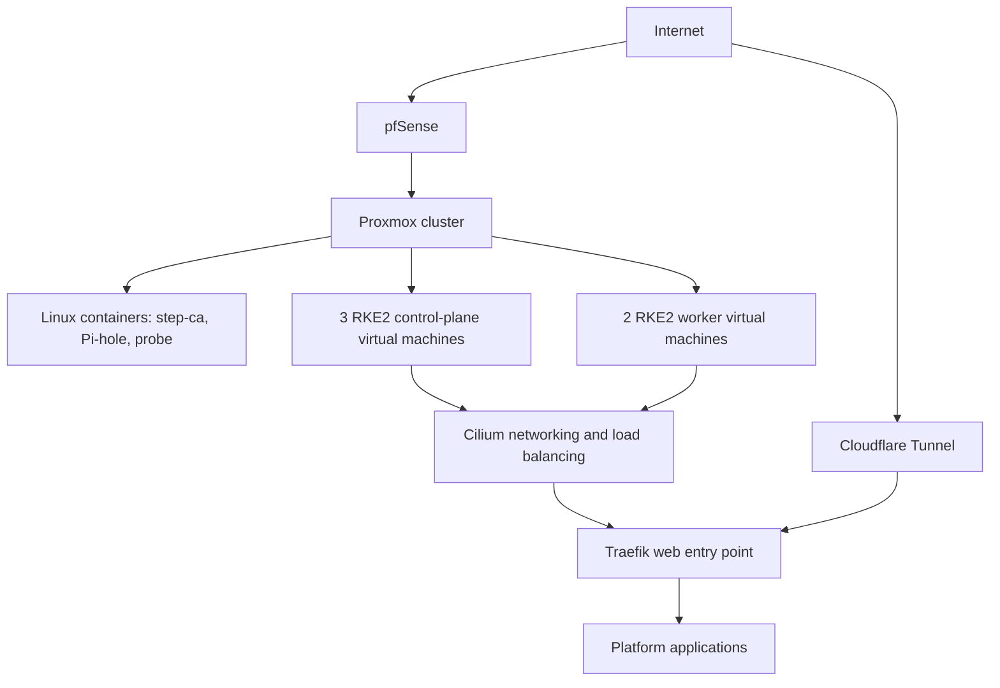

# Homelab Kubernetes Platform

This repository documents the Kubernetes platform I run at home. It explains how I build it, publish services, manage access, store data and apply changes.

I am a Platform and Infrastructure Engineer based in Greater Manchester. This repository focuses on architecture, operating decisions and redacted implementation examples. Environment-specific configuration and credentials are intentionally excluded from the public repository.

The current platform runs RKE2 Kubernetes on virtual machines in Proxmox VE. Flatcar Linux is the operating system on each Kubernetes node. Cilium provides networking, Traefik receives web traffic, Longhorn provides persistent volumes, CloudNativePG runs PostgreSQL databases, Rancher Fleet applies Kubernetes configuration from Git, and Keycloak provides single sign-on.

The earlier version ran directly on three HP ProDesk machines. The [design evolution](docs/evolution.md) document explains what changed and why.

## Architecture

More detail in [docs/architecture.md](docs/architecture.md).

## Main components

| Area | Component | Why it is used |
| --- | --- | --- |
| Virtualisation | Proxmox VE 9 on two hosts | Provides virtual machines, snapshots and an application programming interface (API) for automation. |
| Node operating system | Flatcar Linux | Uses an immutable base image and atomic updates, reducing differences between nodes. |
| Kubernetes | RKE2: three control-plane nodes and two worker nodes | Packages control-plane components into one distribution release, with a controlled server-then-worker upgrade sequence. |
| Provisioning | Pulumi with Python, plus Ignition | Creates virtual machines and configures Flatcar consistently. |
| Networking | Cilium | Provides the container network interface (CNI), service load balancing, network policies and traffic visibility. |
| Kubernetes API address | kube-vip | Keeps one stable address for the Kubernetes API if a control-plane virtual machine stops. |
| Web routing | Traefik | Routes HTTP and HTTPS requests to applications. It is included with RKE2. |
| Storage | Longhorn and CloudNativePG | Longhorn supplies replicated volumes. CloudNativePG manages PostgreSQL clusters. |
| Identity | Keycloak with OpenID Connect (OIDC) | Gives applications a central identity provider for login and access control. |
| Deployment | Rancher Fleet | Applies reviewed Kubernetes configuration from Git repositories. |
| Network edge | pfSense and Cloudflare Tunnel | pfSense protects the local network. Cloudflare Tunnel publishes selected services without opening inbound firewall ports. |
| Certificates and DNS | step-ca and Pi-hole | step-ca issues internal certificates. Pi-hole provides local DNS records. |

The [platform guide](docs/platform.md) explains why these tools were selected and what alternatives I considered.

The platform runs mainly on a 16-thread desktop with 64GB of memory, an NVMe drive and mirrored hard disks managed by ZFS. A smaller second host runs one control-plane virtual machine, the firewall and DNS. The Kubernetes control plane and application data are spread across nodes. The Proxmox layer does not provide automatic host failover. Pulumi can recreate virtual machines and Fleet can reapply declared workloads, but full application-data recovery after primary-host loss waits on the off-cluster backup work described in [docs/operations.md](docs/operations.md). The [architecture guide](docs/architecture.md) states these boundaries explicitly.

## Design decisions

**Virtualise the Kubernetes nodes.** Physical servers had different firmware, disk layouts and network settings. The current virtual machines are created from Pulumi definitions, so replacing a node follows the same process each time.

**Use Cilium for service addresses.** Cilium assigns local network addresses to Kubernetes `LoadBalancer` services and answers Address Resolution Protocol (ARP) requests for them. This replaces MetalLB, so one component now handles both pod networking and service addresses. The implementation is covered in [my Cilium LoadBalancer post](https://blog.godlyobeng.com/cilium-loadbalancer-l2-service/).

**Fit the network design to the network.** The previous cluster used Border Gateway Protocol (BGP) over a dedicated 2.5 Gbps network. The current cluster is on one local area network (LAN), so Cilium Layer 2 announcements provide the same result with less network configuration. BGP remains available if the network becomes routed in future.

**Keep the running set manageable.** GitLab, Harbor, Matrix, AWX and other services have run here to explore specific platform concerns. The current set is limited to services that can be maintained and understood well.

Credentials for the platform live in Vaultwarden.

Further reasoning is in [docs/evolution.md](docs/evolution.md).

## What currently runs

Platform components: Rancher, Longhorn, Keycloak, cert-manager, the CloudNativePG operator, the NVIDIA GPU operator and a Homepage dashboard.

Applications: Vaultwarden, Joplin, Ghost and Jellyfin.

Alongside the cluster: pfSense, step-ca, Pi-hole and an independent probe container.

Also operated on this platform: GitLab, Harbor, AWX, Matrix, Ollama, Plane, OpenProject and Moodle, each run to explore continuous integration, container registries, automation, real-time messaging or graphics processing unit scheduling.

## Behaviour tested in the platform

I test these cases deliberately, so I understand the expected behaviour before a real failure:

- Rebuilding Kubernetes virtual machines from Pulumi
- Kubernetes and application upgrades, with a rollback option at each layer
- Moving the Kubernetes API address when a control-plane node is stopped
- Moving a Cilium `LoadBalancer` address when its worker node is drained
- Switching a CloudNativePG database to its replica
- Draining a node and rebuilding Longhorn replicas
- Signing in through Keycloak using OpenID Connect
- Publishing an application through Cloudflare Tunnel without an inbound firewall rule

The [operations guide](docs/operations.md) describes these checks and the change process.

## Current focus

The next work is operational: an off-cluster backup destination for Longhorn and CloudNativePG, metrics and dashboards, external service checks, and centralised logs. Once there is enough data, I will define service-level objectives using measured availability rather than estimates. More detail is in [docs/operations.md](docs/operations.md).

## Documentation

| Doc | Contents |
| --- | --- |
| [Architecture](docs/architecture.md) | Hosts, cluster layout, traffic flow and failure scenarios |
| [Design evolution](docs/evolution.md) | How v1 became v2 and the reasoning behind it |
| [Networking](docs/networking.md) | pfSense, Cilium, tunnels and identity at the edge |
| [Platform](docs/platform.md) | Component choices and the alternatives considered |
| [Operations](docs/operations.md) | Upgrades, delivery, failure behaviour and what is being built next |
| [Example manifests](docs/examples/) | Redacted Cilium values and custom resources |
| [Cilium Layer 2 LoadBalancer post](https://blog.godlyobeng.com/cilium-loadbalancer-l2-service/) | How a pending Kubernetes `LoadBalancer` receives a LAN address |

## Elsewhere

- Profile: [github.com/godlyObeng](https://github.com/godlyObeng)
- Blog: [blog.godlyobeng.com](https://blog.godlyobeng.com)
