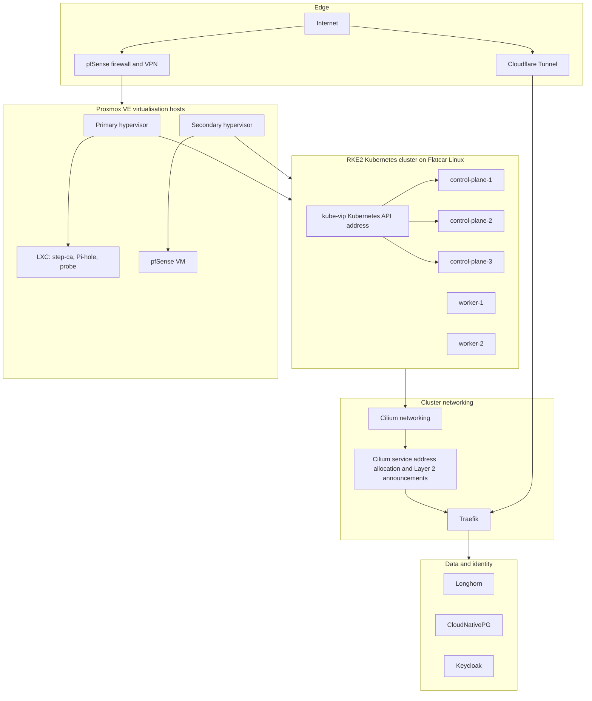

# Architecture

This document describes the current, second-generation platform. Any IP addresses and hostnames are examples.

## Layers

## What the design is intended to do

Three choices guide the design:

1. **Replicate shared services.** The Kubernetes control plane, networking and storage affect many applications, so these are the areas where redundancy matters most.
2. **Make the effect of a failure clear.** The table later in this document states what each common failure affects and how it is handled.
3. **Rebuild infrastructure from code rather than keep unused standby hosts.** At this scale, virtual machines are created from Pulumi definitions when needed. That reconstructs the platform layout. It does not, by itself, restore application data that lived only on the lost host.

## Virtualisation hosts

Two Proxmox VE 9 hosts provide virtual machines for Kubernetes and supporting services.

| Role | Hardware class | What it carries |
| --- | --- | --- |
| Primary | 16-thread Intel desktop, 64GB RAM, NVMe drive and ZFS hard-disk mirror | Most Kubernetes virtual machines, step-ca and the probe container |
| Secondary | 8-thread laptop-class machine, 16GB RAM, SATA solid-state drive | One Kubernetes control-plane virtual machine, pfSense and Pi-hole |

The second host serves two purposes. First, it places one etcd member, the Kubernetes control-plane database, on separate physical hardware. The control plane therefore tolerates the loss of a single control-plane virtual machine without application impact: etcd remains quorate and the API endpoint can move between surviving control-plane nodes. Second, the household firewall and DNS service run separately from the host that carries most Kubernetes workloads. A Kubernetes change cannot therefore take down home networking.

The two Proxmox hosts are clustered for management, not for automatic high availability. If a host fails, the virtual machines on it must be recreated. Pulumi can recreate the Kubernetes virtual machines, and Fleet can reapply declared workloads. Application data that lived only on the lost host is a separate recovery problem, covered in the failure scenarios below and in [operations.md](operations.md). A third host would spread capacity more evenly if the availability requirement changes.

## Kubernetes cluster

| Item | Value |
| --- | --- |
| Distribution | RKE2 |
| Node OS | Flatcar Linux |
| Topology | Three control-plane nodes running etcd, plus two worker nodes |
| Provisioning | Pulumi creates virtual machines; Ignition configures Flatcar at first boot |
| Pod networking | Cilium is the container network interface (CNI); the standard kube-proxy component is disabled |
| Kubernetes API | kube-vip provides one stable virtual IP address across control-plane nodes |
| Web traffic | Traefik receives HTTP and HTTPS traffic through a Cilium `LoadBalancer` address on the LAN |
| Public applications | Cloudflare Tunnel forwards selected public traffic to Traefik |

The reasoning behind each of these choices is set out in [platform.md](platform.md).

Control-plane virtual machines run etcd and the Kubernetes API. Application workloads run on worker nodes. Cilium only advertises `LoadBalancer` addresses from worker nodes. This keeps incoming application traffic away from the control-plane nodes. See [networking.md](networking.md).

## Traffic flow

A LAN service such as `dashboard.lab.example`:

1. Pi-hole resolves the hostname to an address from Cilium's `LoadBalancer` range, `192.168.1.200-240`.
2. One worker node owns a Kubernetes lease for that address and replies to the client's Address Resolution Protocol (ARP) request.
3. Cilium sends the request to Traefik. Traefik then sends it to the Kubernetes Service for the application.

An internet-facing service such as `app.lab.example`:

1. Public DNS points the hostname at Cloudflare.
2. `cloudflared` in the cluster opens an outbound encrypted tunnel to Cloudflare. The firewall does not need an inbound rule for the application.
3. Cloudflare forwards the request through the tunnel to Traefik. Traefik uses the hostname in the request to select the application.

For Kubernetes administration, `kubectl` connects to the kube-vip address. If one control-plane virtual machine stops, kube-vip moves that address to another control-plane node.

## Storage and databases

Longhorn provides persistent block volumes to Kubernetes applications. It stores multiple replicas of a volume on different nodes. More important data receives more replicas; temporary or reproducible workloads receive fewer.

CloudNativePG manages PostgreSQL. Applications declare a database using a Kubernetes `Cluster` resource. The operator then creates a primary database, a replica that receives changes from it, and handles promotion if the primary fails.

Longhorn stores its replicas on the Kubernetes virtual machine disks. The primary Proxmox host uses a ZFS mirror for virtual machine images and bulk data.

## Identity and certificates

Keycloak is the OpenID Connect (OIDC) identity provider for Rancher and compatible applications. step-ca issues Transport Layer Security (TLS) certificates for internal hostnames. cert-manager manages certificates used inside Kubernetes.

## Failure scenarios

The table describes the expected impact of common failures and the normal response. The [operations guide](operations.md) describes how these behaviours are checked.

| Scenario | Impact | Recovery |
| --- | --- | --- |
| Pod or application failure | The affected application instance stops responding | Kubernetes restarts or reschedules the application |
| Worker node lost | Workloads on that node stop; a service address may briefly move | Kubernetes schedules workloads elsewhere; another worker node advertises the address |
| Control-plane virtual machine lost | Kubernetes administration continues if etcd retains a majority of members | kube-vip moves the API address to another control-plane node |
| Secondary Proxmox host lost | The firewall, DNS and one etcd member are unavailable | Restore pfSense and Pi-hole; the Kubernetes cluster retains two etcd members |
| Primary Proxmox host lost | Major outage: most capacity, most etcd members and most application data are on that host | Infrastructure and declarative workloads can be recreated with Pulumi and Fleet. Full application-data recovery is not yet protected against this failure. The off-cluster backup destination described in [operations.md](operations.md) is the control being added to close that gap. |
| Internet connection lost | Public hostnames are unavailable | LAN services remain available through their local Cilium addresses |

The design distinguishes several recovery layers. High availability and replication protect individual Kubernetes node failures. Pulumi and Fleet reconstruct infrastructure and declared workloads. Backup and disaster recovery restore application data after the host that held it is gone. Today the first two layers are in place. The third is the next control to add, and it is what turns a host rebuild into a full recovery.
