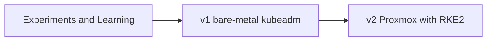

# Design evolution

How the platform changed over time, and the reason for each significant change.

## Timeline

| Generation | What it was | What it established |
| --- | --- | --- |
| Experiments | Single-board computers, Docker hosts, ESXi and early k3s | Linux fundamentals, storage behaviour and the fact that availability requires deliberate design. |
| v1 | Three HP ProDesk machines, Rocky Linux, kubeadm, Longhorn, Cilium with Border Gateway Protocol (BGP) to OPNsense and a dedicated 2.5 Gbps network | Building and operating a cluster from first principles, BGP and the cost of maintaining each component. |
| v2 (current) | Two Proxmox hosts, five Flatcar virtual machines, RKE2 created with Pulumi, Cilium Layer 2 announcements, kube-vip, Traefik and Rancher Fleet | A platform built from code, where Kubernetes nodes can be replaced consistently and workloads are deployed through Git. |

The screenshot in [history/](history/) shows v1. It ran services for family and friends for an extended period. Operating it showed where maintenance effort accumulated, and those lessons shaped v2.

## What changed, and why

### Bare metal to virtual machines

The physical machines differed in firmware, network interface names and disk layout. Replacing or upgrading a node therefore required checking its individual setup.

Proxmox turns the Kubernetes node into a virtual machine created from code. A Flatcar image, Ignition configuration and Pulumi run create the same node definition repeatedly. The trade-off is virtualisation overhead and no automatic host failover. At this scale, recreating a failed virtual machine is a simpler design. [Architecture](architecture.md) explains the host-level boundary.

### kubeadm to RKE2

Building a cluster with kubeadm was useful for understanding how Kubernetes control-plane components fit together. Its ongoing work includes tracking component versions, public key infrastructure (PKI) rotation and upgrade ordering separately.

RKE2 packages control-plane components behind a single distribution release, which reduces component-by-component upgrade coordination while retaining a controlled server-and-worker upgrade sequence. It also includes etcd snapshots and hardened defaults. The [platform guide](platform.md) explains the selection in more detail.

### BGP ring to Cilium L2 announcements

v1 used a dedicated 2.5 Gbps network between the three machines. Cilium connected to OPNsense using BGP, making Kubernetes `LoadBalancer` addresses routable from the rest of the network. This provided practical experience of Cilium BGP and storage replication traffic.

v2 uses one flat local area network (LAN). Cilium Layer 2 announcements provide local `LoadBalancer` addresses without BGP peering. BGP remains appropriate where service addresses are on another network or traffic needs several routed paths. Cilium can use it later without replacing the network component.

Full walkthrough: [Give your bare-metal cluster real LoadBalancer IPs with Cilium](https://blog.godlyobeng.com/cilium-loadbalancer-l2-service/).

### OPNsense to pfSense

The move from OPNsense to pfSense was an intentional lab-only technology comparison rather than an architectural improvement. The functional boundary remained the same: routing, VPN and default-deny edge policy. Running both platforms gave me operational experience with each, while the security approach stayed unchanged.

### NGINX Ingress and Argo CD to Traefik and Fleet

Traefik is included with RKE2, so using it avoids operating a separate ingress controller. Fleet provides GitOps through Rancher, which is already installed. This keeps one management platform for both Kubernetes visibility and workload deployment.

Argo CD is also capable. Fleet was selected to reduce duplicated platform components, not because Argo CD lacks features.

### A scoped application set

The cluster has run GitLab, Harbor, AWX, Matrix, Ollama, Plane and OpenProject at different times. Each explored a specific concern: continuous integration, container registry promotion, single sign-on, real-time messaging or graphics processing unit (GPU) scheduling.

The current set contains services that are actively used: identity, notes, a password manager, a blog, media, a dashboard and Rancher. Keeping a smaller set up to date is more useful than keeping a longer list of unused applications running.

## Principles used to design this platform

**Document failure scenarios.** An availability claim is only meaningful when it states the failure it is designed to tolerate. [Architecture](architecture.md) records the expected impact and response for each main scenario.

**Keep components justified.** Cilium combines service addresses, network policy and traffic visibility. Traefik is already included with RKE2. Fewer components mean fewer upgrades and fewer places to investigate during an incident.

**Separate everyday services from experiments.** The documentation distinguishes active services from workloads deployed to explore a specific technology.

**Make replacement repeatable.** Infrastructure is defined in code, so replacing a Kubernetes virtual machine follows a known procedure.

## Carried forward from v1

- Cilium as the container network interface (CNI), including network policy and WireGuard encryption
- Longhorn and CloudNativePG
- Keycloak as the identity layer
- Rancher for visibility, with Fleet for delivery
- Cloudflare Tunnel for selected public applications

v1 provided the experience that made v2 smaller, quicker to rebuild and easier to operate.
