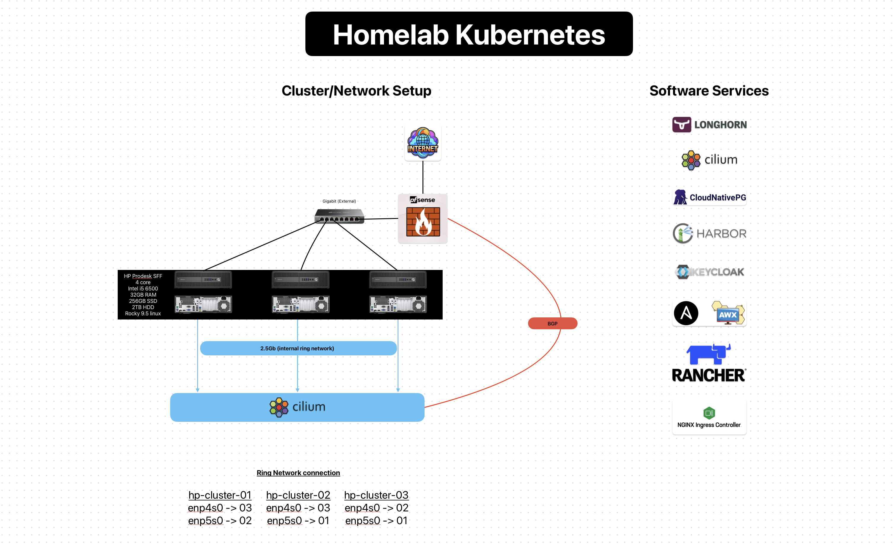

# History: the v1 bare-metal cluster

The image below shows the first generation of the homelab. The current platform is described in [the architecture guide](../architecture.md).

v1 ran on three HP ProDesk small-form-factor machines. Each had an Intel i5-6500 processor, 32GB of memory, and a mix of solid-state and hard-disk storage. They ran Rocky Linux and a Kubernetes cluster built with kubeadm. Cilium provided pod networking. A dedicated 2.5 Gbps network carried traffic between nodes. Cilium used Border Gateway Protocol (BGP) with OPNsense to advertise Kubernetes `LoadBalancer` addresses to the rest of the network. The main services were Longhorn, Harbor, Keycloak, AWX, Rancher and NGINX Ingress.

Building and running v1 provided hands-on experience of Kubernetes cluster lifecycle, BGP and bare-metal operations. The maintenance experience informed the design of v2.

The reasoning behind the move to v2 is in [../evolution.md](../evolution.md).
